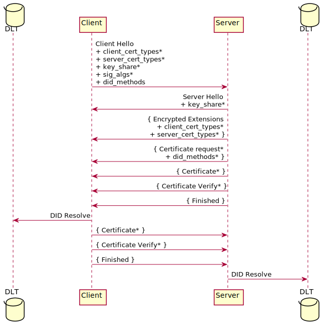
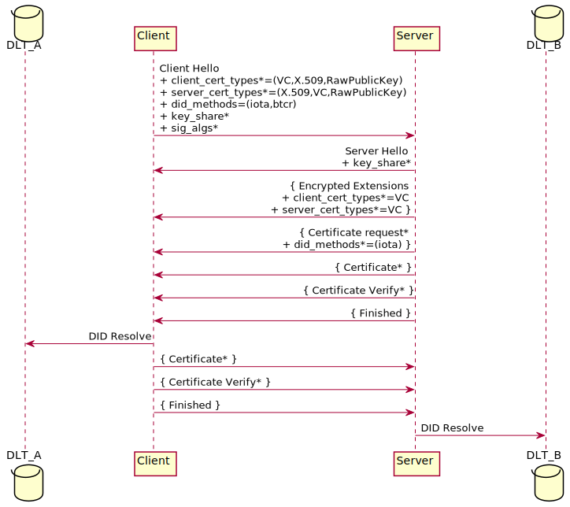
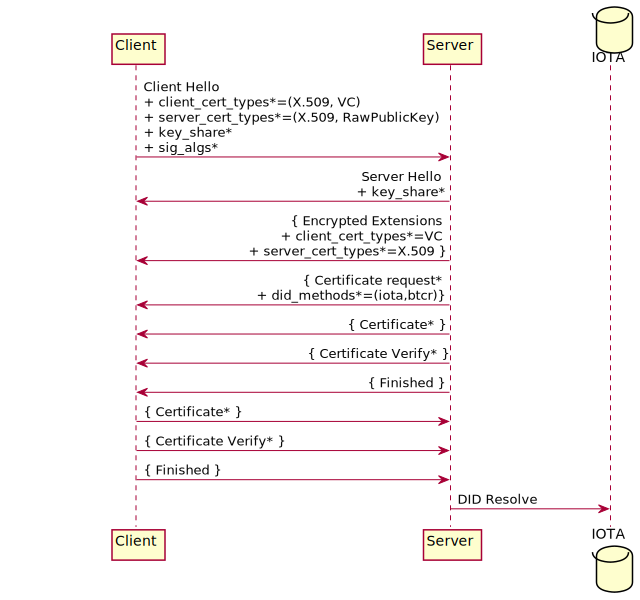
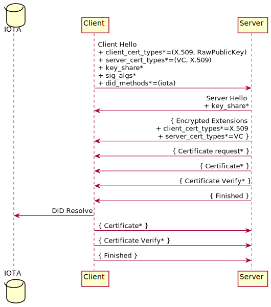

---
###
# Internet-Draft Markdown Template
#
# Rename this file from draft-todo-yourname-protocol.md to get started.
# Draft name format is "draft-<yourname>-<workgroup>-<name>.md".
#
# For initial setup, you only need to edit the first block of fields.
# Only "title" needs to be changed; delete "abbrev" if your title is short.
# Any other content can be edited, but be careful not to introduce errors.
# Some fields will be set automatically during setup if they are unchanged.
#
# Don't include "-00" or "-latest" in the filename.
# Labels in the form draft-<yourname>-<workgroup>-<name>-latest are used by
# the tools to refer to the current version; see "docname" for example.
#
# This template uses kramdown-rfc: https://github.com/cabo/kramdown-rfc
# You can replace the entire file if you prefer a different format.
# Change the file extension to match the format (.xml for XML, etc...)
#
###
title: "Transport Layer Security (TLS) Authentication with Verifiable Credential (VC)"
abbrev: "TODO - Abbreviation"
category: info

docname: draft-vesco-vcauthtls-latest
submissiontype: IETF  # also: "independent", "editorial", "IAB", or "IRTF"
number:
date:
consensus: true
v: 3
area: AREA
workgroup: WG Working Group
keyword:
 - next generation
 - unicorn
 - sparkling distributed ledger
venue:
  group: WG
  type: Working Group
  mail: WG@example.com
  arch: https://example.com/WG
  github: Cybersecurity-LINKS/draft-vesco-vcauthtls
  latest: https://example.com/LATEST

author:
 -
    fullname: Andrea Vesco
    organization: LINKS Foundation
    email: andrea.vesco@linksfoundation.com

 -
    fullname: Leonardo Perugini
    organization: LINKS Foundation
    email: leonardo.perugini@linksfoundation.com

 -
    fullname: Nicola Tuveri
    organization: Tampere University
    email: nic.tuv@gmail.com

normative:

informative:


--- abstract

This document defines a new certificate type and extension for the exchange of Verifiable Credentials (VCs) in Transport Layer Security (TLS). The new certificate type is intended to add the VC as a new means of authentication. The validation process of the VC uses a distributed ledger as the Root of Trust (RoT) of the TLS node's public keys. The nodes can use different distributed ledger technologies to store their public key and to perform the TLS handshake.


--- middle

# Introduction

The Self-Sovereign Identity (SSI) is a decentralised identity model that gives a node control over the data it uses to generate and prove its identity. SSI model relies on three fundamental elements: a distributed ledger as the Root of Trust (RoT) for public keys, Decentralized IDentifier [DID](https://www.w3.org/TR/did-core/), and Verifiable Credential [VC](https://www.w3.org/TR/vc-data-model-2.0/). An SSI aware node builds his identity starting from generating the identity key pair ($sk, pk$). Then the node stores $pk$ in the distributed ledger of choice for other nodes to authenticate it.
A node's DID is a pointer to the distributed ledger where other nodes can retrieve its $pk$. A DID is a Uniform Resource Identifier (URI) in the form _did:did-method-name:method-specific-id_ where _method-name_ is the name of the [DID Method](https://www.w3.org/TR/did-core/) used to interact with the distributed ledger and _method-specific-id_ is the pointer to the [DID Document](https://www.w3.org/TR/did-core/) that contains $pk$, stored in the distributed ledger.
After that, the node can request a VC from one of the Issuers available in the system. The VC contains the metadata to describe properties of the credential, the DID and the claims about the identity of the node <!--in the _credentialSubject_ field,--> and the signature of the Issuer.
The combination of the key pair ($sk, pk$), the DID and at least one VC forms the identity compliant with the SSI model.
A node requests access to services by presenting a Verfiable Presentation [VP](https://www.w3.org/TR/vc-data-model-2.0/). The VP is an envelop of the VC signed by the node holding the VC with its $sk$. The verifier authenticates the node checking the authenticity of the VP and the validity and authenticity of the inner VC before granting or denying access to the requesting node.
<!-- The SSI model subtends the peer-to-peer model of interaction where both types of authentication are possible using VP; one node authenticates the other, or the nodes can authenticate each other. -->
The current implementations of the authentication process run at the Application layer. A client node estabhlishes a TLS channel authenticating the server node with the server's X.509 certificate. Then the server node authenticate the client node that sends its VP at application layer (i.e. over the TLS channel already established). The mutual authentication with VPs occours when also the server node exchange its VP with the client node again at application layer.

SSI is emerging as an identity option for Internet of Thing and Edge nodes in computing continuum environments. In these scenarios, (mutual) authentication with VP can take place directly at the TLS protocol layer, enabling the the peer-to-peer interaction model envisaged by the SSI model.
This document describes the extensions to TLS protocol to support the use of VCs for authentication while preserving the interoperability with TLS endpoints that use X.509 certificates.
The extensions enable server-only and mutual authentication using VC, X.509, Raw Public Key or a combination of VC and X.509 certificates at the TLS endpoints. The ability to perform hybrid authenticated handshakes supports the gradual deployment of SSI in existing systems. Moreover, the extension allow TLS endpoints to use different distributed ledger technologies to store their public keys and during the TLS handshake for authentication purpose.


# Conventions and Definitions

{::boilerplate bcp14-tagged}


# Extensions

## client_certificate_type and server_certificate_type

The TLS extensions ``client_certificate_type`` and ``server_certificate_type`` defined in [RFC7250](https://datatracker.ietf.org/doc/html/rfc7250) are used to negotiate the type of Certificate messages used in TLS to authenticate the server and, optionally, the client. This section defines a new certificate type, called VC, for the TLS 1.3 handshake. The updated CertificateType enumeration and corresponding addition to the CertificateEntry structure are shown below. In the current version of this document VC certificate type is set to 224, one of the values indicated by IANA for private use. CertificateType values are sent in the server_certificate_type and client_certificate_type extensions, and the CertificateEntry structures are included in the certificate chain sent in the Certificate message.

~~~
/* Managed by IANA */
enum {
   X509(0),
   RawPublicKey(2),
   VC(224),
   (255)
} CertificateType;

struct {
   select(certificate_type){
      // The new certificate type defined in this document
      case VC:
         opaque cert_data<1..2^24-1>;

      // RawPublicKey certificate type defined in RFC 7250
      case RawPublicKey:
         opaque ASN1_subjectPublicKeyInfo<1..2^24-1>;

      // X.509 certificate defined in RFC 5246
      case X509:
         opaque cert_data<1..2^24-1>;
   };
   Extension extensions<0..2^16-1>;
} CertificateEntry;

struct {
   opaque certificate_request_context<0..2^8-1>;
   CertificateEntry certificate_list<0..2^24-1>;
} Certificate;
~~~

As per [RFC7250](https://datatracker.ietf.org/doc/html/rfc7250), the client will send a list of certificate types in endpoint_certificate_type extension(s), the server processes the received extension(s) and selects one of the offered certificate types, returning the negotiated value in the EncryptedExtensions message. Note that there is no requirement for the negotiated value to be the same in client_certificate_type and server_certificate_type extensions sent in the same message. Client and server can use different means of authentication as long as the other endpoint is able to verify that specific type of certificate.

# did_methods extension

This section defines the did_methods extension, used as part of an extended TLS 1.3 handshake when VC certificate type is used. This extension contains a list of DID Methods an endpoint supports, i.e. a set of DLTs an endpoint can interact with to resolve the peer's DID. A client MUST send this extension in the extended ClientHello only when it indicates VC support in the server_certificate_type extension. The server MUST send this extension in a CertificateRequest message only if it specified VC as client_certificate_type. The extension format which uses the extension_data field, is used to carry the DIDMethodList structure. The structure of this new extension is shown below.

~~~
enum {
   btcr(0),
   ethr(1),
   iota(2),
   ..
   (65535)
} DIDMethod

struct {
   DIDMethod did_methods<2..2^16-2>
} DIDMethodList
~~~

The list of existing DID Methods is currently maintained by the W3C in the [did-registry](https://www.w3.org/TR/did-spec-registries/#did-methods). Each DID Method is expressed in the form of a string. This document proposes the DIDMethod enum to map these strings into integer values.

# TLS Client and Server Handshake

The Figure below shows the basic full TLS handshake:

<!--
```
@startuml full-hs
database DLT as dlt1 order 1
database DLT as dlt2 order 4
participant Client order 2
participant Server order 3
skinparam sequenceMessageAlign direction
skinparam ParticipantPadding 100
Client -> Server : Client Hello \n+ client_cert_types* \n+ server_cert_types* \n+ key_share* \n+ sig_algs* \n+ did_methods
Server -> Client : Server Hello \n+ key_share*
Server -> Client : { Encrypted Extensions \n+ client_cert_types* \n+ server_cert_types* }
Server -> Client : { Certificate request* \n+ did_methods* }
Server -> Client : { Certificate* }
Server -> Client : { Certificate Verify* }
Server -> Client : { Finished }
Client -> dlt1 : DID Resolve
Client -> Server : { Certificate* }
Client -> Server : { Certificate Verify* }
Client -> Server : { Finished }
Server -> dlt2 : DID Resolve
@enduml
```
-->

<!--  -->

## Client Hello

In order to express support for VC certificate type, a client MUST include an extension of type client_certificate_type or server_certificate_type in the extended ClientHello message as described in Section 4.1.2 of [RFC8446](https://datatracker.ietf.org/doc/html/rfc8446). If the client sends the server_certificate_type extension indicating VC support, it MUST also send the did_methods extension.
<!-- If the client also sends the client_certificate_type extension indicating VC support then it MUST have at least a DID that belongs to one of the DLs specified in the did_methods extension. -->

## Server Hello

When the server receives the ClientHello containing the server_certificate_type extension and/or the client_certificate_type extension, the following scenarios are possible:

- The server does not support the extensions, omits them in EncryptedExtensions and the handshake proceeds with X.509 authentication.
- The server does not support any of the proposed certificate types and terminates the session with a fatal alert of type "unsupported_certificate".
- Both client and server indicate support for the VC certificate type. The server selects VC certificate type, but the client did not send the did_methods extension in addition to the server_certificate_type extension. The server MUST terminate the session with a fatal alert of type "missing_extension".
- Both client and server indicate support for the VC certificate type. The server selects VC certificate type, but the server's DID is not compatible with any of the DID Methods supported by the client, listed in the did_methods extension in ClientHello message. {It terminates the session with a fatal alert of type "unsupported_did_methods"/ It sends a HelloRetryRequest message equipped with the did_methods extension containing the list of DLTs in which it has a DID.} <!-- TBA -->
- Both client and server indicate support for the VC certificate type, the server MAY select the first (most preferred) certificate type from the client's list that is supported by both peers. It MAY include the client_certificate_type in EncryptedExtensions and then request a certificate from the client. In case the server selects VC certificate type, MUST also send the did_methods extension in the CertificateRequest message.

## Certificate Request

The server sends this message to request client authentication. It MUST include the did_methods extension if it specified VC in the client_certificate_type extension. If the ClientHello contained the did_methods extension, the server MUST send a list of DID Methods client and server have in common. If the client did not send the did_methods extension the server MUST select a list of DID Methods it supports. A client that processes this message that does not have a DID compatible with the DID Methods selected by the server MUST send a Certificate message containing no certificates, i.e. with the certificate list field having length 0.

## Certificate

When the selected certificate type is VC, the certificate_list in the Certificate message MUST contain no more than one CertificateEntry with the content of the endpoint's Verifiable Credential. The content of the Verifiable Credential SHOULD be CBOR encoded. After decoding, the endpoint MUST follow the procedure in [VC](https://www.w3.org/TR/vc-data-model-2.0/) to verify the Verifiable Credential.

<!--The endpoint must check that the VC follows the scheme specified in the @context field, then check the validity of the VC metadata, verify the signature of the Issuer on the VC, and then extract the server DID from the credentialSubject field of the VC and resolve the server DID to retrieve the server public key from the distributed ledger. The public is employed to verify the signature in the CertificateVerify message sent by the peer.-->

## Certificate Verify

As discussed in [Section I](#introduction), a Holder wraps its own Verifiable Credential into a Verifiable Presentation and signs it before presenting it to a Verifier for authentication purposes in accordance with SSI model. When the selected certificate type is VC, the subsequent CertificateVerify message acts also as the Holder signature on the Verifiable Presentation. In fact, the signature is computed over the transcript hash that contains also the Verifiable Credential of the sender inside the Certificate message.


# Examples

This section shows some examples of TLS handshakes using different combinations of authentication means.

## Server authentication with Verifiable Credential

This example shows a TLS 1.3 handshake with server authentication. The server selects a Verifiable Credential for authentication.
The client does not own an identity at the TLS level, therefore omits the client_certificate_type extension. The server indicates in the EncryptedExtensions message a
server_certificate_type equal to VC and insert the Verifiable Credential into the Certificate message.

<!-- TODO description of DID resolve -->

<!--
```
@startuml srvr-vc
skinparam sequenceMessageAlign direction
skinparam ParticipantPadding 100

database IOTA order 1
participant Client order 2
participant Server order 3

Client -> Server : Client Hello \n+ server_cert_types*=(VC,X.509) \n+ did_methods*=(iota,btcr) \n+ key_share* \n+ sig_algs*
Server -> Client : Server Hello \n+ key_share*
Server -> Client : { Encrypted Extensions \n+ server_cert_types*=VC }
Server -> Client : { Certificate* }
Server -> Client : { Certificate Verify* }
Server -> Client : { Finished }
Client -> IOTA : DID Resolve
Client -> Server : { Finished }
@enduml
```
-->

<!--  -->

## Mutual authentication with Verifiable Credentials

This example shows a TLS 1.3 handshake with mutual authenitcation. Both client and server select their  Verifiable Credential for authentication.
The client sends the did_methods extension along with the server_certificate_type extension set to VC as the first option. The server sends the server_certificate_type set to VC, the client_cert_type set to VC and the CertificateRequest message together with the did_methods extension with a set of DID Methods both endpoints have in common. Both client and server send their Verifiable Credential into their respective Certificate message.

<!-- TODO description of DID resolve at client and server side -->

<!--
```
@startuml mutual-vc
database IOTA as dlt1 order 1
database IOTA as dlt2 order 4
participant Client order 2
participant Server order 3
skinparam sequenceMessageAlign direction
skinparam ParticipantPadding 100

Client -> Server : Client Hello \n+ client_cert_types*=(VC,X.509,RawPublicKey) \n+ server_cert_types*=(X.509,VC,RawPublicKey) \n+ did_methods=(iota,btcr) \n+ key_share* \n+ sig_algs*
Server -> Client : Server Hello \n+ key_share*
Server -> Client : { Encrypted Extensions \n+ client_cert_types*=VC \n+ server_cert_types*=VC }
Server -> Client : { Certificate request* \n+ did_methods*=(iota) }
Server -> Client : { Certificate* }
Server -> Client : { Certificate Verify* }
Server -> Client : { Finished }
Client -> dlt1 : DID Resolve
Client -> Server : { Certificate* }
Client -> Server : { Certificate Verify* }
Client -> Server : { Finished }
Server -> dlt2 : DID Resolve
@enduml
```
-->

<!--  -->

## Mutual authentication with Client using Verifiable Credential and Server using X.509 Certificate
This example combines the use of a raw public key and an X.509 certificate. The client uses a VC for client authentication, and the server provides an X.509 certificate. The client expresses its ability to process an X.509 certificate or a raw public key from the server. In addtion it is willing to use either a VC or an X.509 certificate for client-side authentication. The server then selects X.509 to authenticate with the client and VC for client authentication. The server then sends a list of DID methods of its choice.

<!--
```
@startuml clnt-vc-srvr-x509
participant Client order 2
participant Server order 3
database IOTA order 4
skinparam sequenceMessageAlign direction
skinparam ParticipantPadding 100

Client -> Server : Client Hello \n+ client_cert_types*=(X.509, VC) \n+ server_cert_types*=(X.509, RawPublicKey) \n+ key_share* \n+ sig_algs*
Server -> Client : Server Hello \n+ key_share*
Server -> Client : { Encrypted Extensions \n+ client_cert_types*=VC \n+ server_cert_types*=X.509 }
Server -> Client : { Certificate request* \n + did_methods*=(iota,btcr)}
Server -> Client : { Certificate* }
Server -> Client : { Certificate Verify* }
Server -> Client : { Finished }
Client -> Server : { Certificate* }
Client -> Server : { Certificate Verify* }
Client -> Server : { Finished }
Server -> IOTA : DID Resolve
@enduml
```
-->

<!--  -->

## Mutual authentication with Client using X.509 Certificate and Server using Verifiable Credential

This example proposes a client authenticating with an X.509 certificate and a server with a VC. The client is capable to process and validate a VC from the server, in fact it also sends the did_methods extension. The server then decides to request an X.509 certificate from the client and to provide a VC to authenticate with the client.

<!--
```
@startuml clnt-x509-srvr-vc
participant Client order 2
participant Server order 3
database IOTA order 1
skinparam sequenceMessageAlign direction
skinparam ParticipantPadding 100

Client -> Server : Client Hello \n+ client_cert_types*=(X.509, RawPublicKey) \n+ server_cert_types*=(VC, X.509) \n+ key_share* \n+ sig_algs* \n+ did_methods*=(iota)
Server -> Client : Server Hello \n+ key_share*
Server -> Client : { Encrypted Extensions \n+ client_cert_types*=X.509 \n+ server_cert_types*=VC }
Server -> Client : { Certificate request* }
Server -> Client : { Certificate* }
Server -> Client : { Certificate Verify* }
Server -> Client : { Finished }
Client -> IOTA : DID Resolve
Client -> Server : { Certificate* }
Client -> Server : { Certificate Verify* }
Client -> Server : { Finished }
@enduml
```
-->

<!--  -->

<!--
## Renegotiation of DID Methods

server sends an HRR when it does not have a DID compatible with the list of DID Methods sent by the client.
-->

# Security Considerations

<!-- We should discuss about the different suite of signature algorithms among W3C and TLS 1.3 -->

<!-- We should discuss or include references to revocation processes -->

All the security considerations presented in [RFC8446](https://datatracker.ietf.org/doc/html/rfc8446) applies to this document as well.
Further considerations, though, about the DID resolution process are worth discussing. Assuming that a DID resolution is performed in clear, a man-in-the-middle could impersonate the DLT node, forge a DID document containing the authenticating endpoint's DID, associate it with a key pair that he owns, and then return it to the DID resolver. Thus, the attacker is able to compute a valid CertificateVerify message by possessing the long term private key. In practice, the man-in-the-middle attacker breaks in transit the immutability feature of the DLT (i.e. the RoT for identity public keys).
A reasonable solution to this attack could be to create a TLS channel towards the DLT node and authenticate only the latter to rely on the received data. The DLT node must be authenticated through an X.509 certificate. The number of DLT nodes within an IoT large scale systems is expected to be very low (i.e. one or a couple of nodes) with respect to the total number of IoT and edge nodes, so adopting X.509 certificates to authenticate those DLT nodes does not reduce the overall benefit in terms of lower complexity and cost associated to certificate management proper of SSI solution.
In order to reduce the overhead of establishing a TLS channel with the DLT node for DID resolution, there are two possible approaches (i) leverage session resumption and 0 round-trip time (0-RTT) features of TLS 1.3 or (ii) change the logic of DLT nodes and adopt a data protection solution (e.g. with HMAC to authenticate the data from DLT node).

# IANA Considerations

This document has no IANA actions..


--- back

# Acknowledgments
{:numbered="false"}

TODO acknowledge.
